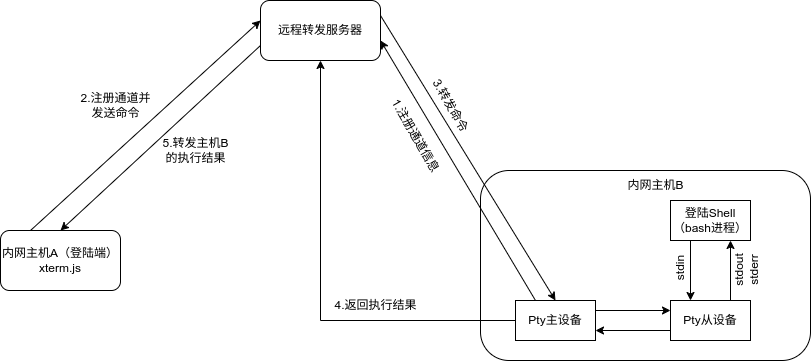

# 一、概述
term penetration 是一个终端内网穿透工具。它的主要功能是使得两个在不同内网的主机能够使用终端进行通信。由于前端是使用 web 方式开发，因此任意一台能够打开网页的终端设备都可以登陆到另一台位于另一个内网的主机。主要原理是通过位于公网的服务器做命令和执行结果的转发。


# 二、基本架构



term penetration 设计要点：
* 主机 B 使用 pty4j 来构建伪终端
* 整体架构基于 Netty 实现，通信协议采用 WebSocket 进行双向通信
* 前端（主机 A ）基于 React 使用 xterm.js 来解析并展示伪终端的返回数据

# 三、部署

本项目使用 ant 进行构建。

介质生成：
* 在 exeServer/scripts 目录下执行 build.sh ，将 ExeServer.tar 放在主机 B 中的某个目录下，解压后执行 exeServer/scripts/start.sh 完成启动。
* 在 retransmission/scripts 目录下执行 build.sh ，将 Retransmission.tar 放在远程服务器中，解压后执行 retransmission/scripts/start.sh 完成启动。
* 前端通过 npm run build 打包出前端介质，并传至远程服务器中（也可以不熟在主机 A 中但会增大通信上的开销）

前端部署：
* 安装 Tomcat 将前端脚本防至 webapps 目录下，并启动 Tomcat
* 安装 Nginx ，完成代理转发。相关配置如下

```shell
http {
        server {
                listen 8081 default_server;
                #listen [::]:80 default_server;

                location /websocket {
                        proxy_pass http://127.0.0.1:8827/websocket;
                        proxy_http_version 1.1;
                        proxy_set_header Upgrade $http_upgrade;
                        proxy_set_header Connection "Upgrade";
                        proxy_set_header Host $host;
                }

                location ^~ /build/ {
                        proxy_pass http://127.0.0.1:8080/build/;
                }
        }
}
```

配置完成后重启 Nginx 服务。

在主机 A 上访问：  http://xxx.xxx.xxx.xxx:8081/[前端应用名称] 即可展示页面。

# 四、演示


